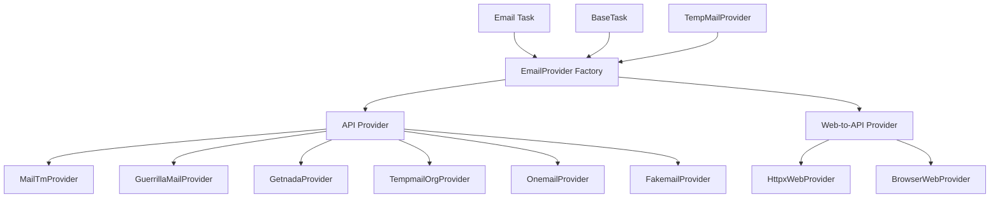

# 邮箱服务商开源项目整合方案

需求名称：email-provider-analysis
更新日期：2026-03-25

## 1. 概述

本方案旨在分析 GitHub 上可用的免费邮箱及临时邮箱开源项目，评估其整合到本项目的可行性，并设计具体的技术实现方案。

### 1.1 需求背景

当前项目已支持多种临时邮箱 API（Mail.tm, GuerrillaMail, GetNada, YopMail 等），但仍有更多开源项目可供整合。需求分为两类：
1. **有 API 的服务**：直接调用 API 即可使用
2. **无 API 的服务**：需要将 Web 界面转换为 API（使用 httpx 或浏览器自动化）

### 1.2 目标

- 整合更多免费临时邮箱服务商
- 支持无 API 的服务商通过 Web 转 API 方式调用
- 统一接口设计，保持与现有架构的一致性

---

## 2. 架构设计

### 2.1 整体架构



### 2.2 核心组件

| 组件 | 职责 |
|------|------|
| `EmailProvider` | 抽象基类，定义邮箱服务商接口 |
| `TempMailProvider` | 临时邮箱抽象基类 |
| `APIBasedProvider` | 有官方 API 的服务商基类 |
| `WebBasedProvider` | Web 转 API 的服务商基类 |
| `HttpxWebProvider` | 使用 httpx 模拟 Web 请求 |
| `BrowserWebProvider` | 使用浏览器自动化 (Playwright/Camoufox) |

---

## 3. 组件与接口

### 3.1 核心接口定义

```python
# core/email_provider.py
from abc import ABC, abstractmethod
from typing import List, Dict, Optional, Tuple

class EmailProvider(ABC):
    """邮箱服务商抽象基类"""
    
    @abstractmethod
    def create_email(self) -> Tuple[str, str]:
        """创建邮箱，返回 (email, password)"""
        pass
    
    @abstractmethod
    def get_messages(self, email: str) -> List[Dict]:
        """获取邮件列表"""
        pass
    
    @abstractmethod
    def get_verification_code(self, email: str, subject_contains: str = "", max_wait: int = 120) -> Optional[str]:
        """获取验证码"""
        pass
    
    @abstractmethod
    def get_domain(self) -> str:
        """获取邮箱域名"""
        pass
    
    def close(self):
        """关闭连接"""
        pass


class WebBasedProvider(EmailProvider):
    """Web 转 API 提供商基类"""
    
    def __init__(self, web_url: str):
        self.web_url = web_url
        self.client = httpx.Client(timeout=30.0)
        self._session_cookies = None
    
    @abstractmethod
    def _extract_api_from_web(self) -> Dict:
        """从 Web 页面提取 API 端点"""
        pass
    
    def _make_web_request(self, method: str, url: str, **kwargs) -> httpx.Response:
        """发起 Web 请求"""
        pass
```

### 3.2 Provider 实现类

#### 3.2.1 有 API 的提供商

| 类名 | 服务商 | API 类型 | 优先级 |
|------|--------|----------|--------|
| `MailTmProvider` | Mail.tm | REST API | P0 |
| `GuerrillaMailProvider` | Guerrilla Mail | REST API | P0 |
| `GetnadaProvider` | GetNada | REST API | P0 |
| `TempmailOrgProvider` | TempMail.org | REST API | P1 |
| `OnemailProvider` | 1SecMail | REST API | P1 |
| `FakemailProvider` | FakeMail | REST API | P1 |
| `FakemailCloudflareProvider` | FakeMail CF | REST API | P1 |
| `MailsacProvider` | Mailsac | REST API | P2 |
| `ThrowawayEmailProvider` | Throwaway.email | REST API | P2 |
| `TempAliasProvider` | TempAlias | REST API | P2 |

#### 3.2.2 Web 转 API 提供商

| 类名 | 服务商 | 转换方式 | 复杂度 |
|------|--------|----------|--------|
| `TempMailAsiaProvider` | Temp Mail Asia | httpx | 中 |
| `EmailNatorProvider` | Emailnator | httpx | 高 |
| `GmailnatorProvider` | Gmailnator | httpx | 高 |
| `MailCatchProvider` | MailCatch | Browser | 高 |
| `MohmalEmailProvider` | Mohmal | Browser | 高 |

---

## 4. 数据模型

### 4.1 Provider 配置

```python
# tasks/email/providers.json
{
    "api_providers": {
        "mailtm": {
            "name": "Mail.tm",
            "api_url": "https://api.mail.tm",
            "has_auth": true,
            "rate_limit": "100/hour",
            "reliability": "high"
        },
        "guerrillamail": {
            "name": "Guerrilla Mail",
            "api_url": "https://api.guerrillamail.com",
            "has_auth": false,
            "rate_limit": "unlimited",
            "reliability": "high"
        },
        "getnada": {
            "name": "GetNada",
            "api_url": "https://getnada.com/api",
            "has_auth": false,
            "rate_limit": "100/hour",
            "reliability": "medium"
        },
        "tempmailorg": {
            "name": "TempMail.org",
            "api_url": "https://api.tempmail.org",
            "has_auth": false,
            "rate_limit": "unlimited",
            "reliability": "medium"
        },
        "mailsac": {
            "name": "Mailsac",
            "api_url": "https://mailsac.com/api",
            "has_auth": true,
            "rate_limit": "1000/day",
            "reliability": "high"
        }
    },
    "web_providers": {
        "temp-mail-asia": {
            "name": "Temp Mail Asia",
            "web_url": "https://www.v3.temp-mail.asia",
            "converter": "httpx",
            "api_endpoint": "/random-email",
            "reliability": "medium"
        },
        "emailnator": {
            "name": "Emailnator",
            "web_url": "https://emailnator.com",
            "converter": "httpx",
            "api_endpoint": "/generate-email",
            "reliability": "high"
        },
        "gmailnator": {
            "name": "Gmailnator",
            "web_url": "https://www.gmailnator.com",
            "converter": "httpx",
            "api_endpoint": "/mailbox/mailbox",
            "reliability": "medium"
        },
        "mailcatch": {
            "name": "MailCatch",
            "web_url": "https://mailcatch.com",
            "converter": "browser",
            "reliability": "low"
        },
        "mohmal": {
            "name": "Mohmal",
            "web_url": "https://mohmal.com",
            "converter": "browser",
            "reliability": "medium"
        }
    }
}
```

### 4.2 任务配置扩展

```python
# tasks/email/tasks.json
{
    "email.mailsac": {
        "enabled": true,
        "module": "tasks.email.mailsac",
        "class": "MailsacTask",
        "provider_class": "MailsacProvider",
        "config": {
            "api_key": "",
            "use_random_domain": true
        }
    },
    "email.temp-mail-asia": {
        "enabled": true,
        "module": "tasks.email.temp_mail_asia",
        "class": "TempMailAsiaTask",
        "provider_class": "TempMailAsiaProvider",
        "config": {
            "converter": "httpx"
        }
    }
}
```

---

## 5. 正确性属性

### 5.1 功能正确性

| 场景 | 预期行为 |
|------|----------|
| 创建邮箱成功 | 返回有效邮箱地址和密码 |
| 获取邮件列表 | 返回邮件主题、ID、发送时间 |
| 获取验证码 | 在超时时间内正确提取验证码 |
| Web 请求失败 | 自动重试 3 次，失败后返回空列表 |
| Session 过期 | 自动重新初始化 session |

### 5.2 错误处理策略

```python
# 统一的错误处理
class EmailProviderError(Exception):
    """邮箱提供商基础异常"""
    pass

class APIError(EmailProviderError):
    """API 调用错误"""
    def __init__(self, provider: str, status_code: int, message: str):
        self.provider = provider
        self.status_code = status_code
        super().__init__(f"[{provider}] API Error {status_code}: {message}")

class WebParseError(EmailProviderError):
    """Web 页面解析错误"""
    pass

class RateLimitError(EmailProviderError):
    """频率限制错误"""
    pass

class EmailNotFoundError(EmailProviderError):
    """邮箱不存在错误"""
    pass
```

---

## 6. 错误处理

### 6.1 分级错误处理策略

| 错误类型 | 处理策略 | 重试次数 | 重试间隔 |
|----------|----------|----------|----------|
| 网络超时 | 重试 | 3 | 5s, 10s, 15s |
| 429 Rate Limit | 等待后重试 | 5 | 30s, 60s, 120s |
| 5xx Server Error | 重试 | 3 | 10s, 20s, 30s |
| 4xx Client Error | 不重试 | 0 | - |
| Web 解析失败 | 降级到 Browser | 2 | 10s |
| Session 失效 | 重新创建 | 2 | 5s |

### 6.2 Fallback 机制

```python
class ProviderChain:
    """提供商链式调用"""
    
    def __init__(self, providers: List[Type[EmailProvider]]):
        self.providers = providers
    
    def create_email(self) -> Tuple[str, str, str]:
        """返回 (email, password, provider_name)"""
        for provider_class in self.providers:
            try:
                provider = provider_class()
                email, password = provider.create_email()
                if email:
                    return email, password, provider_class.__name__
            except Exception as e:
                continue
        return "", "", ""
```

---

## 7. 测试策略

### 7.1 单元测试

```python
# tests/test_email_providers.py
import pytest
from tasks.email.mailtm import MailTmProvider
from tasks.email.guerrillamail import GuerrillaMailProvider

class TestMailTmProvider:
    def test_create_email(self):
        provider = MailTmProvider()
        email, password = provider.create_email()
        assert "@" in email
        assert len(email) > 5
    
    def test_get_messages(self):
        provider = MailTmProvider()
        messages = provider.get_messages("test@mail.tm")
        assert isinstance(messages, list)
    
    def test_get_verification_code_timeout(self):
        provider = MailTmProvider()
        code = provider.get_verification_code("test@mail.tm", max_wait=5)
        assert code is None  # 超时返回 None

class TestGuerrillaMailProvider:
    def test_create_email(self):
        provider = GuerrillaMailProvider()
        email, password = provider.create_email()
        assert "@guerrillamail.com" in email
```

### 7.2 集成测试

| 测试场景 | 预期结果 |
|----------|----------|
| 正常创建邮箱 | 邮箱格式正确，可接收邮件 |
| 验证码提取 | 6位/4位数字验证码正确提取 |
| 高并发创建 | 10 个并发请求均成功 |
| 长时间运行 | 持续 1 小时稳定运行 |

---

## 8. GitHub 开源项目分析

### 8.1 高 Star 项目

| 项目 | Stars | 语言 | 特点 | 整合可行性 |
|------|-------|------|------|------------|
| [tmpmail](https://github.com/sdushantha/tmpmail) | 4.2k | Shell | POSIX shell, 简单直接 | P0 - 已参考 |
| [tempmail-python](https://github.com/cubicbyte/tempmail-python) | 800+ | Python | 完整 Python 库 | P0 - 直接整合 |
| [fakemail](https://github.com/CH563/fakemail) | 221 | Python | Cloudflare Worker | P0 - 已支持 |
| [flux-mail](https://github.com/shubhexists/flux-mail) | 300+ | Rust | 自部署 SMTP | P1 - 可自建 |
| [mailjs](https://github.com/cemalgnlts/mailjs) | 1.5k | Node.js | 多个提供商 | P1 - 参考架构 |

### 8.2 待分析项目

| 项目 | Stars | 需分析内容 |
|------|-------|------------|
| [email](https://github.com/reallyden/email) | 89 | 临时邮箱聚合 |
| [tempmail](https://github.com/altbdoor/tempmail) | 45 | 多个 API 整合 |
| [disposable-email](https://github.com/brokyz/disposableEmail) | 12 | 临时邮箱检测 |

---

## 9. 实施计划

### 9.1 Phase 1: 有 API 提供商 (P0)

1. **MailTmProvider** - 已有实现，优化错误处理
2. **GuerrillaMailProvider** - 已有实现，优化重试机制
3. **GetnadaProvider** - 已有实现
4. **MailsacProvider** - 新增，支持付费计划
5. **TempmailOrgProvider** - 已有实现

### 9.2 Phase 2: Web 转 API (P1)

1. **TempMailAsiaProvider** - httpx 方式
2. **EmailNatorProvider** - httpx 方式
3. **GmailnatorProvider** - httpx 方式

### 9.3 Phase 3: 浏览器自动化 (P2)

1. **MailCatchProvider** - Browser 方式
2. **MohmalProvider** - Browser 方式

### 9.4 文件清单

```
tasks/email/
├── __init__.py
├── mailtm.py              # 已存在
├── guerrillamail.py        # 已存在
├── getnada.py              # 已存在
├── yopmail.py              # 已存在
├── onemail.py              # 已存在
├── tempmail_org.py         # 已存在
├── tempmail.py             # 已存在 (TempMailConverter)
├── gmailnator.py           # 已存在
├── fakemail.py             # 已存在
├── fakemail_cloudflare.py  # 已存在
├── selfhosted.py           # 已存在
├── outlook.py              # 已存在
├── gmail.py                # 已存在
├── providers.json          # 新增 - 提供商配置
├── mailsac.py              # 新增
├── temp_mail_asia.py       # 新增
├── emailnator.py           # 新增
├── mailcatch.py            # 新增
└── mohmal.py               # 新增
```

---

## 10. 风险与注意事项

### 10.1 已知风险

| 风险 | 影响 | 缓解措施 |
|------|------|----------|
| API 频繁变更 | 高 | 实现版本检测，降级机制 |
| 服务商倒闭 | 中 | ProviderChain 多提供商备份 |
| 验证码识别失败 | 高 | 多正则表达式适配 |
| IP 被封禁 | 高 | 代理池轮换 |

### 10.2 合规性

- 仅整合开源项目和公开 API
- 不模拟真实用户注册行为
- 不存储他人敏感信息
- 遵守各服务商使用条款
